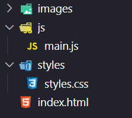

# Conversor de Unidades - Projeto Resilia Educação

Este é o projeto do Conversor de Unidades desenvolvido como parte do curso de formação Dev Fullstack da Resilia Educação no projeto Códigos do Amanhã da EBANX. O objetivo do projeto é criar uma página web interativa que permita aos usuários converter valores entre diferentes unidades de medida, incluindo comprimento, peso e temperatura.

## Requisitos

- Um campo numérico de entrada para o valor a ser convertido.
- Três campos de seleção: um para selecionar a categoria, outro para a unidade de medida de origem e outro para a unidade de medida de destino.
- As opções de unidades de medida devem ser selecionáveis de forma dinâmica, atualizadas com base na unidade de origem selecionada.
- Um botão de "Converter" para realizar a conversão.
- Um campo de saída para exibir o resultado da conversão.

## Estrutura do Projeto

O projeto possui a seguinte estrutura de arquivos:

- pasta images com as imagens do projeto
- pasta js com arquivos JavaScript
- pasta styles com arquivos CSS
- index.html: arquivo HTML contendo a estrutura da página.
- styles.css: arquivo CSS para estilização da página.
- main.js: arquivo JavaScript contendo a lógica do conversor.

## Evidência de Entrega

Neste projeto, utilizei o DOM para criar um conversor de unidades interativo em HTML, CSS e JavaScript. O DOM foi empregado para selecionar elementos, atualizar opções de seleção dinamicamente e exibir o resultado da conversão. O projeto oferece uma experiência de usuário intuitiva e funcional.

